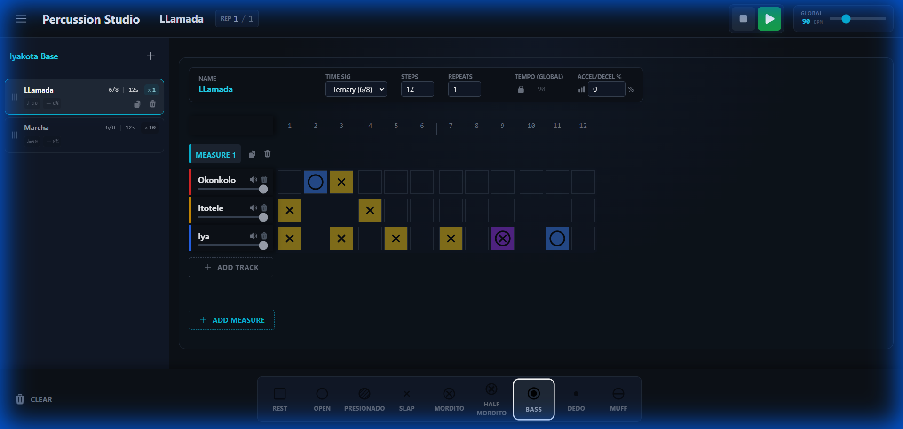

# Percussion Studio

**A web-based percussion pattern sequencer for Afro-Cuban rhythms and beyond.**

🎵 **Live Demo:** [https://pich78.github.io/percussion-studio/](https://pich78.github.io/percussion-studio/)

## Overview

Percussion Studio is a browser-based application for creating, editing, and playing percussion patterns. It features a grid-based sequencer with support for multiple instruments, sound packs, and complex multi-measure compositions. It is optimized for both desktop creation and mobile playback.



### Key Features

- 🥁 **Multi-track sequencer** with visual grid interface
- 📱 **Optimized Mobile View** for playback and practice
- 🎼 **Multiple instruments** (Batá drums, congas, and more)
- 🪘 **Batá Rhythm Support** with dedicated organization
- 🔊 **Sound pack system** for different audio samples
- 📊 **Multi-measure sections** with repeats and tempo control
- 🎵 **Count-in** with customizable settings (4/4, 6/8)
- 💾 **Import/Export rhythms** as YAML files
- 🎨 **Modern, responsive UI** with real-time playback

## Getting Started

### Running Locally

1. Clone the repository:
   ```bash
   git clone https://github.com/pich78/percussion-studio.git
   cd percussion-studio
   ```

2. Start a local web server:
   ```bash
   python -m http.server 8000
   ```

3. Open your browser to `http://localhost:8000`

### Project Structure

```
percussion-studio/
├── index.html              # Main application entry point
├── desktop.html            # Desktop interface
├── mobile.html             # Mobile interface
├── manifest.json           # Auto-generated resource registry
├── data_specifications.md  # Detailed data format documentation
├── js/                     # Application source code
├── data/                   # All content data
│   ├── instruments/        # Instrument definitions
│   ├── sounds/             # Sound packs with audio files
│   ├── rhythms/            # Rhythm compositions
│   └── assets/             # Shared assets (icons, etc.)
└── tools/                  # Utility scripts
    └── generate_manifest.py
```

## Creating Content

### 1. Creating a New Instrument

Instruments define the abstract capabilities of a percussion instrument type (e.g., what sounds it can make).

**Location:** `data/instruments/{SYMBOL}.yaml`

**Example:** `data/instruments/CON.yaml` (Conga)

```yaml
name: "Conga"
symbol: "CON"
description: "A tall, narrow, single-headed drum from Cuba"
sounds:
  - letter: "O"
    name: "Open Tone"
    svg: "open.svg"
  - letter: "S"
    name: "Slap"
    svg: "slap.svg"
  - letter: "B"
    name: "Bass"
    svg: "bass.svg"
  - letter: "T"
    name: "Tip"
    svg: "tip.svg"
```

### 2. Creating a Sound Pack

Sound packs map instrument articulations to actual audio files.

**Location:** `data/sounds/{PACK_NAME}/{SYMBOL}.{PACK_NAME}.yaml`

**Example:** `data/sounds/studio_conga/CON.studio_conga.yaml`

```yaml
name: "Conga (Studio Recording)"
description: "High-quality studio recorded conga samples"
files:
  O: "conga_open.wav"
  S: "conga_slap.wav"
  B: "conga_bass.wav"
  T: "conga_tip.wav"
```

### 3. Creating a Rhythm

Rhythms define complete compositions with multiple instruments and patterns.

**Location:** `data/rhythms/{RHYTHM_NAME}.yaml`

**Example:** `data/rhythms/basic_conga_pattern.yaml`

```yaml
name: "Basic Conga Pattern"
global_bpm: 120

sound_kit:
  conga_1:
    instrument: "CON"
    pack: "studio_conga"
  
  conga_2:
    instrument: "CON"
    pack: "studio_conga"

playback_flow:
  - name: "Main Pattern"
    repetitions: 4
    subdivision: 4      # 4 for binary (4/4), 3 for ternary (6/8)
    steps: 16
    measures:
      - pattern:
          conga_1: "||O---|S---|O---|S---|"
          conga_2: "||--B-|--B-|--B-|--B-|"
```

### 4. Creating Batà Rhythms

Batà rhythms have a special structure and metadata system.

**Location:** `data/rhythms/Batà/{Folder}/`

**Structure:**
- Each rhythm family gets its own folder (e.g., `Yakota`, `Alumbanche`)
- **Metadata File:** A file named `{Folder}_metadata.yaml` defines properties for the whole group (Orishas, Classification)
- **Rhythm Files:** Individual `.yaml` files for each variation

### 5. Updating the Manifest

After creating or modifying any data files, regenerate the manifest:

```bash
cd tools
python generate_manifest.py
```

## Pattern Writing Tips

### Meter and Subdivision

- **Binary (4/4)**: Use 16 steps, subdivision of 4
- **Ternary (6/8)**: Use 12 steps, subdivision of 3
- **Compound (12/8)**: Use 24 steps, subdivision of 3

### Common Patterns

**Basic 4/4 Beat:**
```yaml
"||O---|O---|O---|O---|"  # Quarter notes
"||O-O-|O-O-|O-O-|O-O-|"  # Eighth notes
```

**6/8 Pattern:**
```yaml
"||O--|S--|O--|S--|"      # 12 steps, grouped by 3
```

## User Guides

Comprehensive guides for using Percussion Studio:

| Platform | English | Italiano |
|----------|---------|----------|
| **Desktop** | [User Guide (EN)](docs/user-guide-desktop-en.md) | [Guida Utente (IT)](docs/user-guide-desktop-it.md) |
| **Mobile** | [User Guide (EN)](docs/user-guide-mobile-en.md) | [Guida Utente (IT)](docs/user-guide-mobile-it.md) |

## Documentation

- **[data_specifications.md](data_specifications.md)**: Detailed technical specifications

## License

This project is open source. See the repository for license details.
